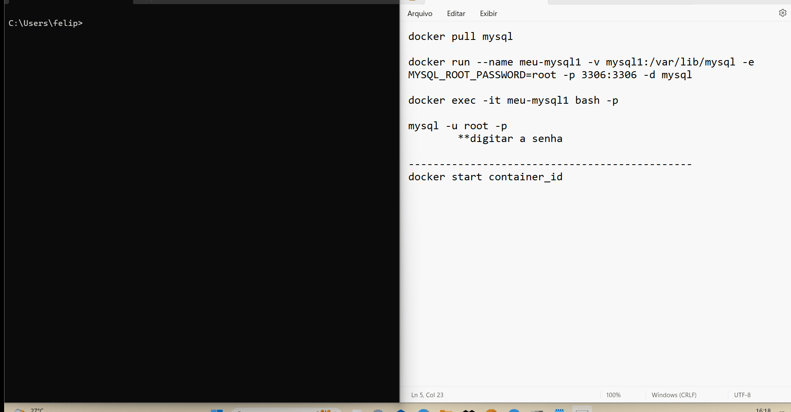
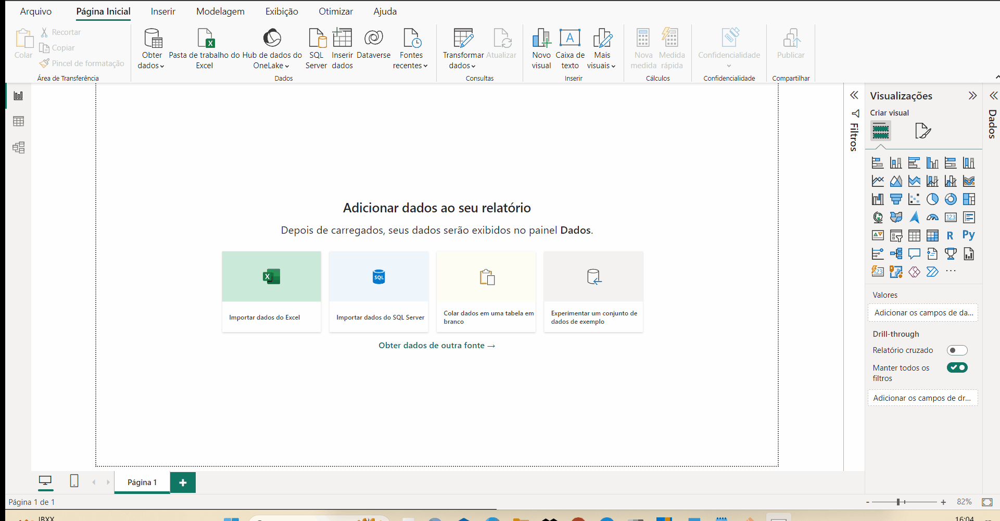
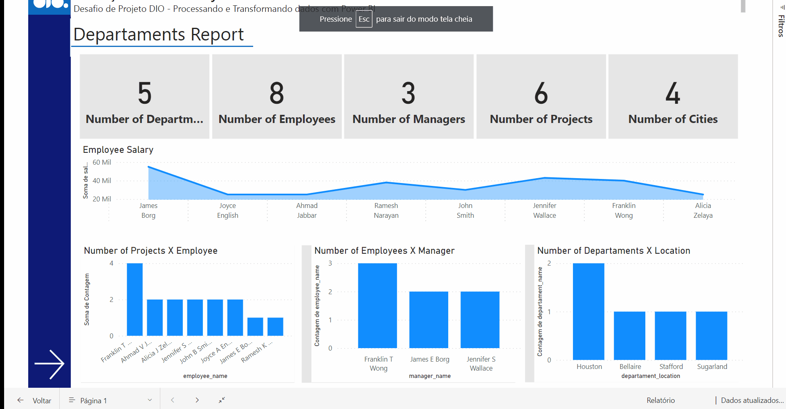

# Processando_e_Transformando_Dados_Power_BI
Desafio de Projeto "Processando e Transformando Dados com Power BI" do curso Santander Coders 2023 - DIO 

Para acessar o relatório via Power BI: [https://app.powerbi.com/links/WEYQ3vuXAa?ctid=c80aeec9-df0b-47f4-b6c7-d2d1fa3f801b&pbi_source=linkShare](https://app.powerbi.com/links/WEYQ3vuXAa?ctid=c80aeec9-df0b-47f4-b6c7-d2d1fa3f801b&pbi_source=linkShare)

## ✒️Autor
- [Felipe Zanardo](https://github.com/FelipeBZanardo)

## 📋Descrição

**1. Criação de uma instância na Azure para MySQL**
Por decisão própria, ao invés de utilizar uma instância do MySQL na Azure, foi utilizado o sistema de container e imagens do Docker.

**2. Criar o Banco de dados com base disponível no GitHub**
O Banco de Dados está disponível no seguinte link: [https://github.com/julianazanelatto/power_bi_analyst/tree/main/M%C3%B3dulo%203/Desafio%20de%20Projeto](https://github.com/julianazanelatto/power_bi_analyst/tree/main/M%C3%B3dulo%203/Desafio%20de%20Projeto)

**3. Integração do Power BI com MySQL no Azure**
Foi feito a integração do MySQL via Docker como comentado no item 1.

**4. Verificar problemas na base a fim de realizar a transformação dos dados**

## ⚙️ Configuração do MySQL via Docker

**1. Pull da Imagem do MySQL:**

`docker pull mysql`

**2. Criação do Container com Volume (armazenar os dados), junto a definição de usuário e senha, e também da porta para o servidor local (localhost):**

```
docker run --name meu-mysql -v mysql:/var/lib/mysql -e MYSQL_ROOT_PASSWORD=root -p 3306:3306 -d mysql
```
**3. Execução do Container:**
`docker exec -it meu-mysql bash`

**4. Acesso ao banco de dados MySQL: (Será solicitado a senha)**
`mysql -u root -p`

<p align="center">
  
</p>

## ⚙️ Conexão do MySQL com o Power BI

**1. Abrir PowerBI**
**2. Clicar em "Obter Dados"**
**3. Selecionar "MySQL"**
**4. Definir:
	- Servidor: localhost
    - Banco Dados: azure_company**
**5. Selecionar autenticação por banco de dados e colocar: 
	- usuário: root
	- senha: root**

<p align="center">
  
</p>

## 📝 Instruções e etapas das transformações
1. **Verifique os cabeçalhos e tipos de dados** - ✅
- Abreviações foram retiradas dos cabeçalhos deixando apenas siglas que são inevitáveis (SSN, por exemplo);
- Por [recomendação](https://gist.github.com/thiamsantos/654ec002f04c86d53611923a8b4c3a65), os nomes das colunas devem estar em letras minúsculas, separadas por underline;
- Na tabela “dept_location”, o departamento de número 5 está triplicado. Foi feito alteração, já que não é possível números iguais.

2. **Modifique os valores monetários para o tipo "double preciso"** - ✅
- O valor monetário “salary” já estava atualizado com o tipo double.

3. **Verifique a existência dos nulos e analise a remoção** - ✅

- Há apenas um “null” em toda a base de dados. Trata-se do "super_ssn" do colaborador James E. Borg, não é necessário excluir essa linha da base de dados.

4. **Os "employees" com nulos em "Super_ssn" podem ser os gerentes. Verifique se há algum colaborador sem gerente** - ✅

- Explicado no item anterior.

5. **Verifique se há algum departamento sem gerente** - ✅  

- Nem todos os departamentos são listados e, portanto, não há gerentes.
- Departamentos sem gerentes: 2, 3;
- Foi criado departamentos fictícios para os departamentos 2 e 3.

6. **Se houver departamento sem gerente, suponha que você possui os dados e preencha as lacunas** - ✅
```
= Table.InsertRows(
    #"Colunas Renomeadas",
    3,
    {[departament_name="Financial", departament_number=2, manager_ssn="123456789", manager_start_date=Date.FromText("1993-05-24"), departament_create_date=Date.FromText("1980-01-01"), azure_company.dept_locations = Table.SelectRows(departament_locations, each [departament_number] = 2), azure_company.employee = Table.SelectRows(employees, each [ssn] = "123456789"), azure_company.project = projects],
    [departament_name="Personal", departament_number=3, manager_ssn="453453453", manager_start_date=Date.FromText("1991-08-02"), departament_create_date=Date.FromText("1991-01-01"), azure_company.dept_locations = Table.SelectRows(departament_locations, each [departament_number] = 3), azure_company.employee = Table.SelectRows(employees, each [ssn] = "453453453"), azure_company.project = projects]}
)
```

7. **Verifique o número de horas dos projetos** - ✅
- Há um projeto que não foi iniciado (0 horas) – Trata-se do projeto número 20 do colaborador cujo SSN = 888665555.

8. **Separar colunas complexas** - ✅
- Selecionada a coluna "address" na tabela "employee";
- Primeiro foi ajustado uma linha que não estava no padrão dos demais (com um separador "-" a mais);
- A coluna "address" foi dividida em outras quatro: "street", "number", "city" e "state".

9. **Mesclar consultas "employee" e "departament" para criar uma tabela "employee" com o nome dos departamentos associados aos colaboradores. A mescla terá como base a tabela "employee". Fique atento, essa informação influencia no tipo de junção** - ✅

- Verificar a tabela resultante da mescla no relatório. 

10. **Neste processo elimine as colunas desnecessárias** - ✅ 

- Deixadas apenas duas colunas: "employee_name" com o nome completo de cada colaborador e, "departament_name" com o nome de cada departamento relacionado.

11. ** Realize a junção dos colaboradores e respectivos nomes dos gerentes . Isso pode ser feito com consulta SQL ou pela mescla de tabelas com Power BI. Caso utilize SQL, especifique no README a query utilizada no processo** - ✅

- Foi feito a mescla no Power BI;
- Deixadas apenas duas colunas:  "employee_name" com o nome completo de cada colaborador e, "manager_name" com o nome de cada gerente relacionado.

12. **Mescle as colunas de Nome e Sobrenome para ter apenas uma coluna definindo os nomes dos colaboradores** - ✅

- Verificar a tabela resultante da mescla no relatório. 

13. **Mescle os nomes de departamentos e localização. Isso fará que cada combinação departamento-local seja único. Isso irá auxiliar na criação do modelo estrela em um módulo futuro** - ✅

- Verificar a tabela resultante da mescla no relatório. 

14. **Explique por que, neste caso supracitado, podemos apenas utilizar o mesclar e não o atribuir.** - ✅

- Ao atribuir uma nova consulta, ocorre a "combinação em coluna" de duas ou mais tabelas (nesse caso em específico, apenas duas), o que ocasiona na soma de linhas das tabelas com inúmeros “null” na correspondência.

- Ao mesclar, ocorre uma "combinação em linha" através de colunas em comum entre as tabelas. Com isso, há o aumento de colunas (foram excluídas as desnecessárias) que relacionam os dados da primeira tabela com a segunda, e não a “soma” como acontece no “atribuir”.

15. **Agrupe os dados a fim de saber quantos colaboradores existem por gerente** - ✅

- Verificar a tabela resultante da mescla no relatório. 

16. **Elimine as colunas desnecessárias, que não serão usadas no relatório, de cada tabela** - ✅

- Verificar a tabela resultante da mescla no relatório. 

## Demonstração do Relatório
<p align="center">
  
</p>

## Dificuldades do Projeto

- Preferi deixar esse desafio para o final do Bootcamp. Já que envolvia vários assuntos, como criação, conexão e inserção de dados no Banco de Dados, transformação de dados com o Power Bi e a linguagem M e a criação do relatório.

- Para não gastar créditos disponíveis na nuvem Azure, decidi utilizar o MySQL no Docker, tive alguns problemas para criação do container junto com o volume (por isso deixei o passo a passo aqui no GitHub).

- Para obter mais conhecimento, decidi fazer boa parte das transformações e limpeza dos dados com a Linguagem M, tornando o andamento do projeto um pouco mais demorado.

- Utilizei o visual do [relatório](https://github.com/FelipeBZanardo/Relatorio_Vendas_Power_BI) do último desafio de projeto como base para esse relatório.

## 📈 Melhorias futuras

- Melhor utilização da linguagem M;
- Aumentar o número de páginas do relatório com mais informações.


